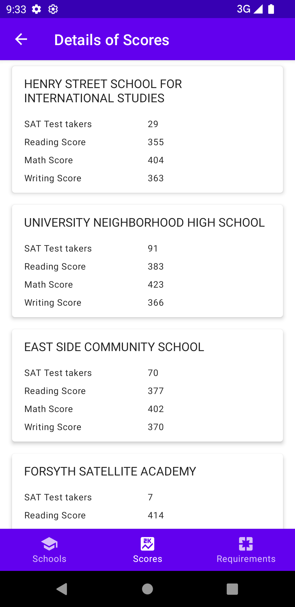
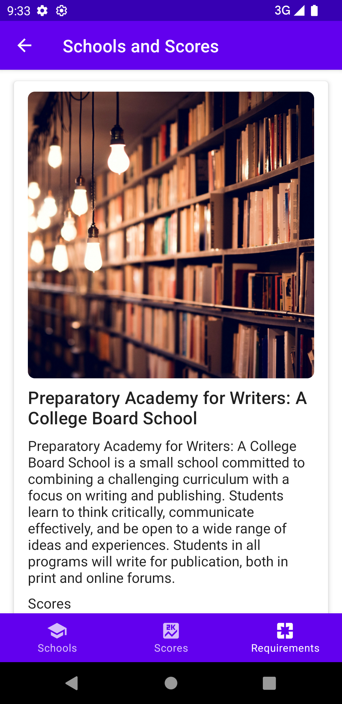

# NYCCompose
App that demonstrates the usage of the following topics

- Dagger
- StateFlow
- Cortoutines
- Retrofit
- Jetpack Compose

It fetches a couple of remote API's
1. https://data.cityofnewyork.us/resource/s3k6-pzi2.json
2. https://data.cityofnewyork.us/resource/f9bf-2cp4.json

